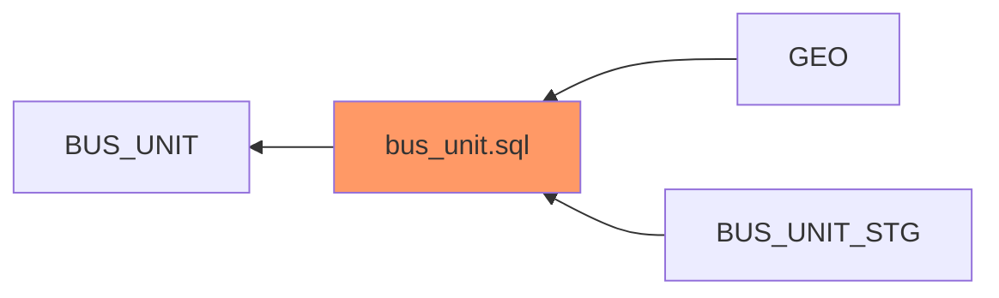
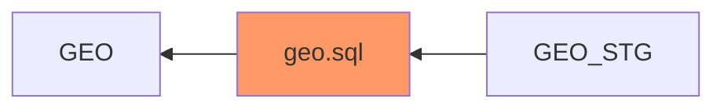
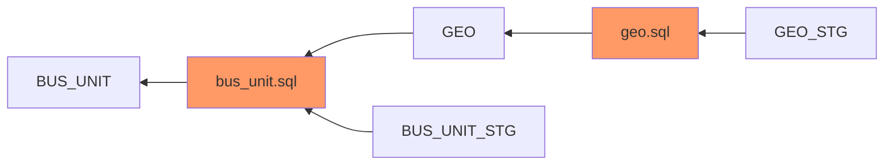
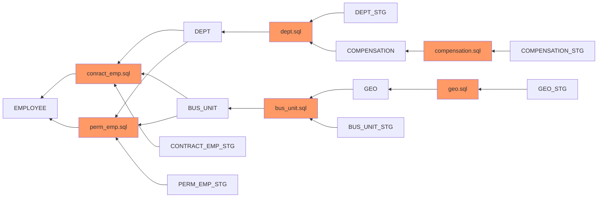

## Table of Contents
  - [Table of Contents](#table-of-contents)
  - [1. Introduction](#1-introduction)
  - [2. Directory Structure of the repository](#2-directory-structure-of-the-repository)
  - [3. Installation](#3-installation)
  - [4. Usage](#4-usage)
    - [Mermaid Js Diagram for EMPLOYEE](#mermaid-js-diagram-for-employee)
    - [Mermaid Js Link (Open Via Browser)](#mermaid-js-link-open-via-browser)
  - [5. Future Scope](#5-future-scope)
## 1. Introduction
analyse-etl-flow.py is a tool which can be used to Visualise an ETL flow in the form of Mermaid Graph/Flow Diagram.

In the feild of data engineering, we often come across SQL code and we try to analyse it and find the dependencies/source & target used in the SQL. For Example, consider the below SQL, lets call it as bus_unit.sql.

```SQL
INSERT INTO BUS_UNIT
SELECT SUBSTR(A.BUS_UNIT,0,3)||'|'||B.PIN||SUBSTR(B.GEO_NM,0,3) AS BUS_UNIT_CD 
FROM BUS_UNIT_STG A, 
LEFT JOIN GEO B ON A.GEO_PIN_CODE= B.GEO_PIN 
WHERE A.ELETE_DTM IS NOT NULL;
```
Here, BUS_UNIT can be classified as Target table and the sources are BUS_UNIT_STG & GEO. Below diagram depicts the same. 


It is also possible that GEO & BUS_UNIT_STG might not be the true source for BUS_UNIT table. There can be some transformation Logic hich is used to populate GEO & BUS_UNIT_STG.

To find that, this time we will have to consider GEO & BUS_UNIT_STG as targets and look for any SQL which inserts data into any of these tables. for this example we can look into the SQL files in [sql directory](https://github.com/akash-adhikary/analyseEtlFlow/tree/main/sql). 

After manually searching, we found the following SQL code (geo.sql).

```SQL
INSERT INTO GEO 
SELECT * FROM GEO_STG WHERE DELETE_DTM IS NOT NULL;
```


This is used to populate GEO table which was one of the source table for BUS_UNIT. now the complete flow would look like this :- 


This shows that Analysis of SQLs and discoveing dependencies is an iterative process and performing it manually can be timeconsuming and labour intensive as in most of the  cases, the number of tables or SQLs can be in hundreds or thousands. 
Source table exploration can help in estimation & planning of the project. Visualizing ETL Flow in the form of Flow charts/Diagram con help the users to under the complexity of the ETL pipeline and resolve dependencies.

analyseEtlFlow.py can be used to easily analyse/Explore large & complex ETL flows and create documentation. refer to [usage](#4-usage) section to better understand how the script can be used to generate these diagrams.

## 2. Directory Structure of the repository
Here is the directory structure.

```
.
├── ▼etl_flow/
│   ├── contains output .md files
|   ├── xyz.md
├── sql/
│   ├── contains sql files which acts as an input for the python script that it scans through
|   ├── xyz.sql
├── analyzeEtlFlow.py
└── README.md
```

## 3. Installation

To download this repo download it directly from github and extract, or it can be also cloned via github cli using the below command.
```bash
gh repo clone akash-adhikary/analyseEtlFlow
```

## 4. Usage
SQL files can be placed the sql folder or path of sql files can be mentioned the ```inputDir``` variable in analyzeEtlFlow.py contains the relative directory to sql files.

Once the sqls are placed in the correct directory, target table name can be passed to ```visualizeFlow()``` function as done below
```python 
visualizeFlow(['EMPLOYEE'])
```

On running succesfully it would produce the below output.

### Mermaid Js Diagram for EMPLOYEE

### Mermaid Js Link (Open Via Browser)
[Mermaid JS API](https://kroki.io/mermaid/svg/eNqFkV0LgjAUhu_9FULXdhnkIDAdIviFzouuhtk0wY_l9P-n1aktkm42OOc5z97DqiHnVz3xkVb03ZAXI2Ut34pboxvGAQexH50wRpqDY7JUviDTNOfTbnIhkHbMUpqF3l_OjkKSWDahs56mxP3Hcza0v1PFOAlki0wqCoi_CsjZV6EL4yOEWIxPLzwO3a9dgxiHqUW8KFyFzpOgU1e_3RAGaS6OloIM_IwNGVbBivVgn50PMcy8Wgpe9C1nncjHuu9gTl5FXezzieqUqlwuh5U6lPSybhpzU-536A5QztL-)

## 5. Future Scope
1. In future this script can be enhanced to handle collapsable graph which will help in managing large ETL diagrams and add modularity.
2. currently this script can parse SQL files and extract meaningful information only if the input files have the right SQL syntax. more language support can be added.

