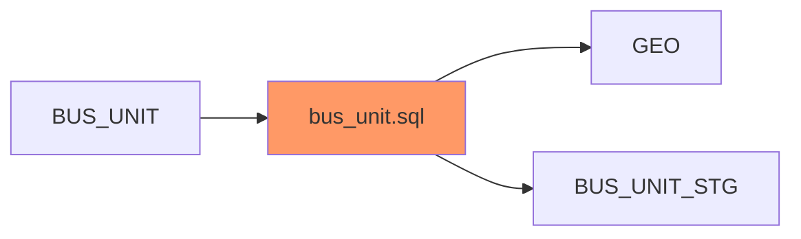
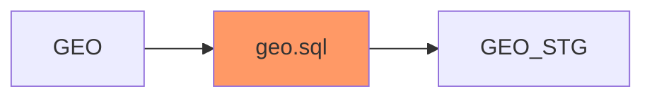
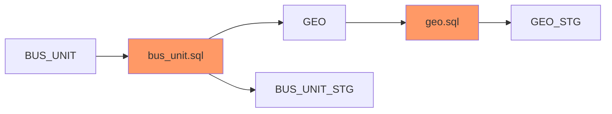

# analyseEtlFlow.py
The tool, analyseETLFlow.py lives up to its name by providing a powerful solution for analyzing and visualizing ETL (Extract, Transform, Load) flows. It allows data engineers to gain insights into the intricacies of these flows by generating Mermaid Graphs or Flow Diagrams. In the field of data engineering, SQL code is frequently encountered, and it becomes crucial to analyze it in order to identify the dependencies, as well as the sources and targets involved. 

## Background
For instance, let's take the following SQL code as an example, which we'll refer to as bus_unit.sql.

```SQL
INSERT INTO BUS_UNIT
SELECT SUBSTR(A.BUS_UNIT,0,3)||'|'||B.PIN||SUBSTR(B.GEO_NM,0,3) AS BUS_UNIT_CD 
FROM BUS_UNIT_STG A, 
LEFT JOIN GEO B ON A.GEO_PIN_CODE= B.GEO_PIN 
WHERE A.ELETE_DTM IS NOT NULL;
```
Here, BUS_UNIT can be classified as Target table and the sources are BUS_UNIT_STG & GEO. Below diagram depicts the same. 


It is also possible that GEO & BUS_UNIT_STG might not be the true source for BUS_UNIT table. There can be some transformation Logic hich is used to populate GEO & BUS_UNIT_STG.

To find that, this time we will have to consider GEO & BUS_UNIT_STG as targets and look for any SQL which inserts data into any of these tables. for this example we can look into the SQL files in [sql directory](https://github.com/akash-adhikary/analyseEtlFlow/tree/main/sql). 

After manually searching, we found the following SQL code (geo.sql).

```SQL
INSERT INTO GEO 
SELECT * FROM GEO_STG WHERE DELETE_DTM IS NOT NULL;
```


This is used to populate GEO table which was one of the source table for BUS_UNIT. now the complete flow would look like this :- 


This shows that Analysis of SQLs and discoveing dependencies is an iterative process and performing it manually can be timeconsuming and labour intensive as in most of the  cases, the number of tables or SQLs can be in hundreds or thousands. 
Source table exploration can help in estimation & planning of the project. Visualizing ETL Flow in the form of Flow charts/Diagram con help the users to under the complexity of the ETL pipeline and resolve dependencies.

analyseEtlFlow.py can be used to easily analyse/Explore large & complex ETL flows and create documentation.

Here is the directory structure.

## Installation 

this repo can be cloned using the below command. 

## Usage

SQL files can be placed the sql folder or path of sql files can be mentioned the ```inputDir``` variable.


