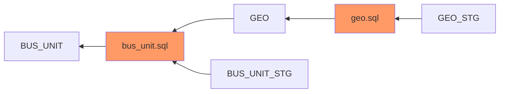

# Mermaid Js Diagram for BUS_UNIT

# Mermaid Js Link (Open Via Browser)
[Mermaid JS API](https://kroki.io/mermaid/svg/eNpLL0osyFAI8rHmSiotji_NyyzRKy7MUdDVtXMKDY4P9fMMseZyd_UHCSArsLKyApLOOYnFxdZcMJXxwSHueBWmp-bDTAeaCTYYpgcqhaI8GUS5pKYpwIQU0jJzcqyU0yzNrAGn8jwG)