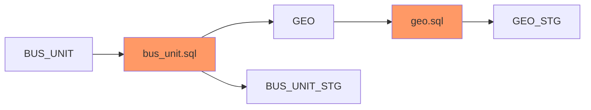

# Mermaid Js Diagram for BUS_UNIT

# Mermaid Js Link (Open Via Browser)
[Mermaid JS API](https://kroki.io/mermaid/svg/eNpLL0osyFDwCbLmcgoNjg_18wxR0NW1Syotji_NyyzRKy7MseZC5llZWQFJ55zE4mKQQndXf7zyMEPjg0PcrbmAqkGC6an5EIOhDEwzIcqTQSIuqWkKcNm0zJwcK-U0SzNrANqTPAY=)