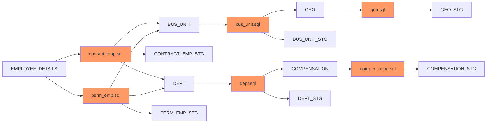

# Mermaid Js Diagram for EMPLOYEE_DETAILS

# Mermaid Js Link (Open Via Browser)
[Mermaid JS API](https://kroki.io/mermaid/svg/eNqFUcsKgzAQvPsVQs_2WGiEgtUggi80HnoK1kYr-EiN_n8N0Wq12kvYnR1mZrNZE9OnbAeqBB3f9m4QYgMizbJDWVEuSV01cdJiUtIjexWqtAAAAP2rFzFjnH6NQhy5FvrH0z0XBZqOcO-JQ2T-4xvQR78DUtKUU7p5txlthyR8dgg-DJwp9KjJJ_eO4a7KWxFk3i0kTOjtzkdRYcETcfRB6CA9VqsvdXzohhqyPHeTxNWE7pwuDl1SUrG4zetqvPQ3suMnJPvF-CAjtRAYivX6w8U5YpBU_kzTvCjAIT2f1DeqQNfI)