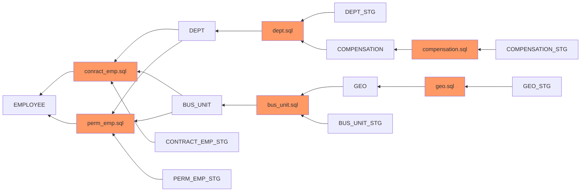

# Mermaid Js Diagram for EMPLOYEE

# Mermaid Js Link (Open Via Browser)
[Mermaid JS API](https://kroki.io/mermaid/svg/eNqFkV0LgjAUhu_9FULXdhnkIDAdIviFzouuhtk0wY_l9P-n1aktkm42OOc5z97DqiHnVz3xkVb03ZAXI2Ut34pboxvGAQexH50wRpqDY7JUviDTNOfTbnIhkHbMUpqF3l_OjkKSWDahs56mxP3Hcza0v1PFOAlki0wqCoi_CsjZV6EL4yOEWIxPLzwO3a9dgxiHqUW8KFyFzpOgU1e_3RAGaS6OloIM_IwNGVbBivVgn50PMcy8Wgpe9C1nncjHuu9gTl5FXezzieqUqlwuh5U6lPSybhpzU-536A5QztL-)