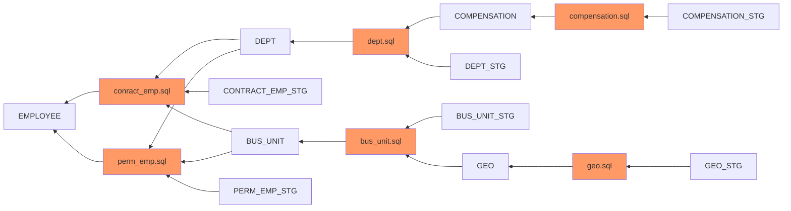

# Mermaid Js Diagram for E

# Mermaid Js Link (Open Via Browser)
[Mermaid JS API](https://kroki.io/mermaid/svg/eNqFkV0LgjAUhu_9FULXdhm0QVA6IsgPdF10NcxmCVOX0_-fi05u0ceNwtnzvucZu3S5vLrpHjtF23R50TNey7m6CdfzViRM9vGREOwEJKF68gYhhMavL3KlsOPHEU3XPmVjjGV0-4_fHDJ2iHZ_eyXv6t9WJmFFE5KGps5X0HT5Cp257EFCr9ZXDhMSZWu6iyM9BcKKaRQEPgKnQbGhqV7dIDNpQdwkrYotiX-eF20teaPyvmobWGPK21eZXs9OWZUX3kLTuP2hALnnkW2gfwEvXRi5ZSUEmpXLBb4Dn9TS_g==)